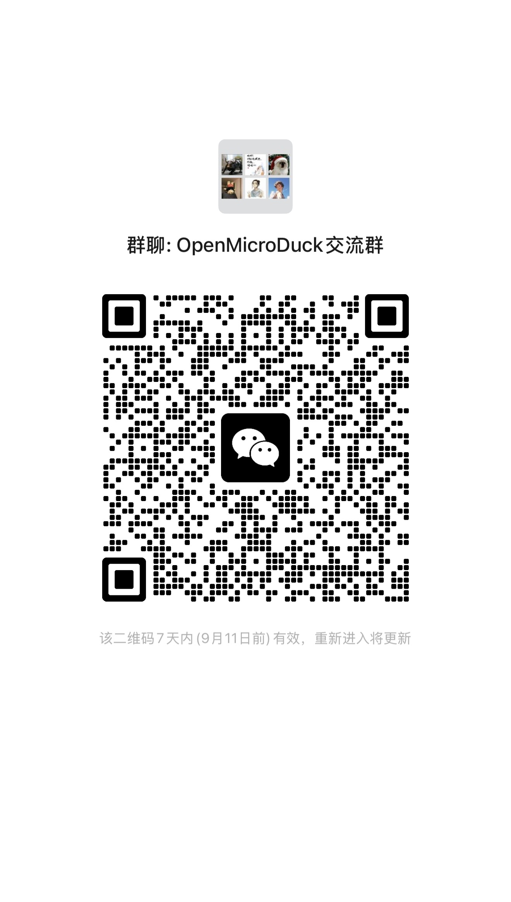

# OpenMicroDuck

**A fully open-source 25 cm bipedal robot duck**

[English](README.md) | [中文](README_zh.md)

---

## What is this

OpenMicroDuck is a **fully open-source** bipedal robot platform: a 25 cm, sub-1 kg duckling with 15 degrees of freedom that walks, turns its head, makes sounds, and can run reinforcement-learning policies.

This project is **inspired by MicroDuck from Hugging Face / Pollen Robotics** — our thanks to them for bringing this little duck into the world and showing developers everywhere that a bipedal robot can be this lovable and within reach, and for openly sharing their training ecosystem so we can stand on their shoulders and keep going. Building on MicroDuck, we will publicly release the hardware drawings, PCB, BOM, software stack, and training environment from our reproduction process.

It is our practice of **technology democratization**, and our thanks to MicroDuck.

## **Community Group** 

  

## Why we built it

**Lower the barrier.** The core technology of bipedal robots is not as distant as it seems — but imported servo kits costing thousands of yuan, closed-source structures, and scattered tutorials keep too many people out. We took every piece apart, validated it, and re-implemented it with an affordable domestic supply chain, then opened everything: a main board that only needs RK3566-class compute, a battery pack that is safe and removable, and structures you can make on a single 3D printer.

**Grow the ecosystem.** We hope more supply-chain partners will join in — servos, main boards, batteries, 3D-printing and injection-molded structures. The compatibility matrix is public; equivalent parts from any manufacturer can be adapted. Competition happens on open standards, and the whole ecosystem benefits.

**Spark more creativity.** What a duck can do should not be defined by us. Re-skin it, even change its form, write a new skill, tune a new gait, add a sensor — we look forward to more developer remixes, and to uses we could never imagine. What you create is not just a robot duck; it is the starting point of the next interesting, valuable product.

## Key specs

| Item | Spec (planned) |
|---|---|
| Body | 25 cm / ≤1 kg |
| DoF | 15 (5×2 legs + 4 head-neck + 1 beak) |
| Servos | 15 × Feetech-compatible alternatives |
| Main board | RK3566-class compute platform |
| Control | 50 Hz on-board policy loop; RL training based on MuJoCo / PPO |
| Battery | Swappable 18650 battery pack |
| Structure | 3D-printed (FDM / resin) + sheet metal parts |

## Roadmap

| Milestone | Date | Goal |
|---|---|---|
| M1 | 2026-09 | Full assembly; RL walking validation |
| M2 | 2026-10 | Design freeze; drawings / BOM / firmware fully open-sourced; first third-party reproductions |
| M3 | 2026-11 | **Stable reproducibility for developers**; bilingual (CN/EN) tutorials live; reproduction success rate published |
| M4 | 2026-12 | Complete experience ready; structure × electronics compatibility matrix v1 |
| M5 | 2027 ~ | Ecosystem growth: skill packs, ongoing compatibility work |

An open-source project is not measured by small-batch unit counts, but by reproduction success rate and developer experience. Every milestone is reviewed in public; test data and issue lists are fully open.

## Get involved

Every level of contribution matters:

1. **Follow** — Star this repo, join the community (Discord / Bilibili / WeChat groups), follow the progress and spread the word
2. **Docs** — Write and translate bilingual tutorials
3. **Reproduce** — Print, assemble, file Issues on tolerances and interference; reproduction data is the hardest currency of open hardware
4. **Create** — Skill packs, appearance remixes, training-pipeline improvements
5. **Co-build** — Core-module PRs; join the maintainer committee and shape the technical direction together

See `CONTRIBUTING.md` (coming soon).

## Licenses

| Content | License |
|---|---|
| Hardware drawings, PCB, BOM | CERN-OHL-S |
| Software stack, training environment | Apache-2.0 |
| Tutorials & docs | CC BY-SA |

## Acknowledgements

This project is inspired by MicroDuck from Hugging Face / Pollen Robotics and reuses their publicly available training ecosystem. Once again, our thanks to the MicroDuck team for their pioneering work and open spirit — without them, this project would not exist. OpenMicroDuck is an independent community open-source project with no affiliation to Hugging Face or Pollen Robotics.
