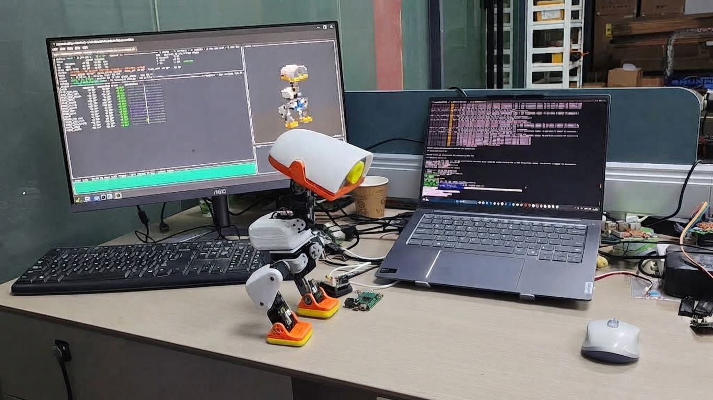
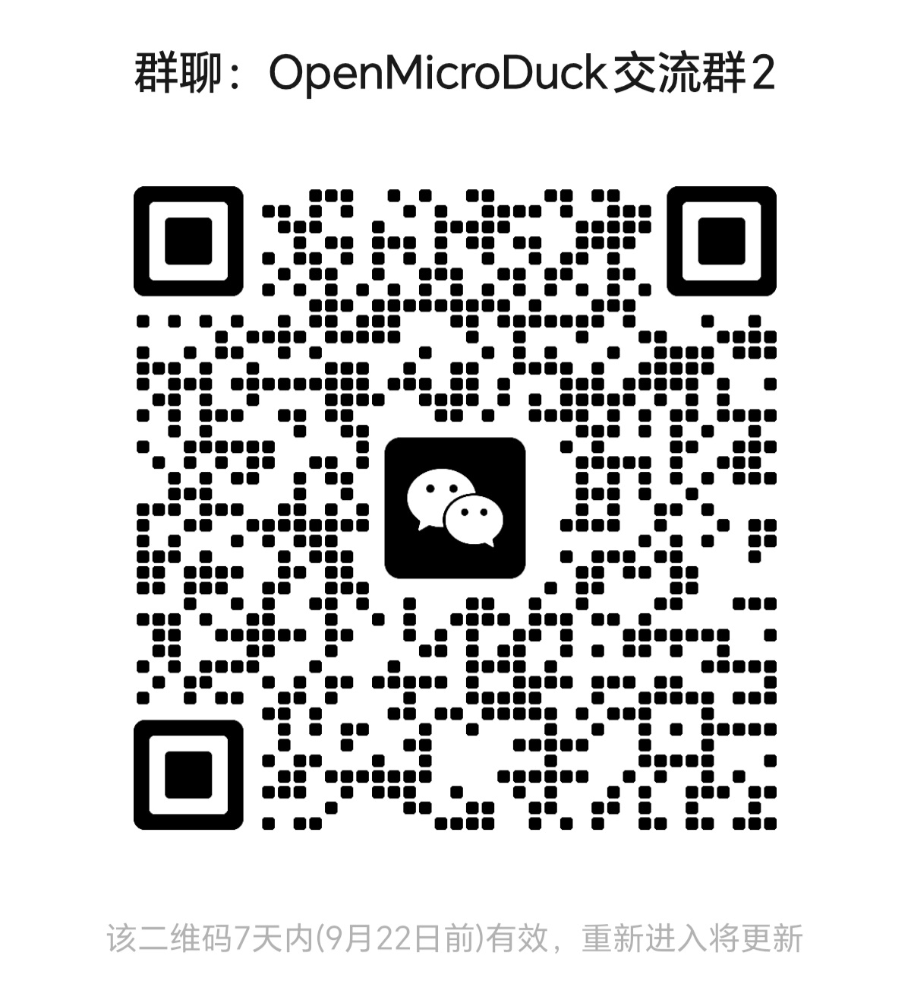

# OpenMicroDuck

**一只完全开源的 25cm 双足机器人**

[English](README_en.md) | [中文](README.md)

---

## 这是什么

OpenMicroDuck 是一个**完全开源**的双足机器人平台：一只 25cm 高、不到 1kg 的小鸭子，15 个自由度，能走、会转头、能发声，可以运行强化学习策略。

本项目受** Hugging Face / Pollen Robotics 的 MicroDuck**的启发——感谢他们把这只小鸭子带到世界面前，让全球开发者看到双足机器人可以如此可爱而触手可及；也感谢他们以开放的态度公开训练生态，让我们得以站在他们的肩膀上继续向前。在 MicroDuck 的基础上，我们将把复现过程的硬件图纸、PCB、BOM、软件栈、训练环境——全部公开发布。

它是我们对"技术平权"的一次实践，也是对 MicroDuck 的致谢。

## 当前进展

飞特 HD-1910 的 BAM 执行器参数已更新到我们 fork 的 [microduck_rl](https://github.com/JoyandAI/microduck_rl)（`develop` 分支），可直接查看 [hd1910 参数目录](https://github.com/JoyandAI/microduck_rl/tree/develop/vendor/bam/bam/params/hd1910)。

### 最新视频

[国产方案调通啦 — MicroDuck 复刻·第三话](https://www.bilibili.com/video/BV1GdYC68Enz/)

飞特 HD-1910 已经调通基本流程，更多动作和流畅控制进一步调校中

Zero转接HAT板已经回片，测试中...

## 交流群

  

## BOM

由于整机集成度比较高，如果完全等所有零配件都ready，再塞进鸭子离线跑，可能要等待比较长的时间。
这里分了两个阶段：
- 第一阶段（桌面调试）：主控和舵机驱动板外置，这样可以由电源适配器供电，主控也可以接显示屏，舵机可由驱动板直接连接PC，方便调试。
- 第二阶段（整机集成）：Zero HAT板和IMU转接板完成之后，再部署已经调试好的模型和软件，完整塞进机器人内部，形成一台完整的整机。

### 桌面调试
| 器件  | 型号 | 规格  | 数量 | 参考单价和链接 |
| --- | ------------------------------- | --- | --- | --- |
| 舵机  | **飞特 HD-1910-C001**  | 恒力空心杯舵机，4~8.4V，堵转扭矩 10kg*cm  | 15  | [118](https://item.taobao.com/item.htm?id=1014620157895&mi_id=0000xBjtqiNSYJUq7QGMPpbYwmNEROqnEVZwYJWi5M4hP3Q&skuId=6133422044091&spm=a21n57.shop_search.0.0.18263d65wuqx4I) | 
| 主控  | **Radxa ZERO 3W** | RK3566, 2GB RAM，带WiFi, 无eMMC板, 带排针版 | 1 |   [309](https://item.taobao.com/item.htm?id=763812025816&mi_id=0000uT5x0cTXxWeiB08JXVyTWI8UsD7hlB5D9f1engmhabY&spm=tbpc.boughtlist.suborder_itemtitle.1.2b562e8dNOWpmj&skuId=6066053424678)    |
| SD卡  | MicroSD/TF卡 | 64GB, A2 | 1 | ~100 |
| IMU模组  | LSM6DSV16X模块 | 支持I2C和SPI接口 | 1 | 51 |
| 摄像头模组 | IMX219摄像头模组 | MIPI FPC排线，500万像素 |  1 |  |
| 结构件 | PLA[+TPU] FDM 3D打印 | 有条件的话，脚垫可选用TPU打印 | 1 | - |
| 轴承 | 6700K | 10 * 15 * 3 | 3 | [1](https://item.taobao.com/item.htm?id=576923148723&skuId=6137219048846) |
| 轴承 | ET2216 | 16 * 22 * 4| 1 | [2.7](https://item.taobao.com/item.htm?id=576923148723&skuId=6137219048846) |
| 紧固件 | 螺丝 | M2自攻 | 若干 | |
| 电线 | 特软硅胶线、铁氟龙线 | 30cm | 若干 | |
| 舵机转接线 | | PH2.0转5264 3P转接线（调试用），先用1根PH2.0 3P接驳1根5264 3P线 | 1 | - |
| 麦克风 | | | | |
| 扬声器 | | | | |

### 整机集成
| 器件  | 型号 | 规格  | 数量 | 参考单价和链接 |
| --- | ------------------------------- | --- | --- | --- |
| 舵机  | **飞特 HD-1910-C001**  | 恒力空心杯舵机，4~8.4V，堵转扭矩 10kg*cm  | 15  | [118](https://item.taobao.com/item.htm?id=1014620157895&mi_id=0000xBjtqiNSYJUq7QGMPpbYwmNEROqnEVZwYJWi5M4hP3Q&skuId=6133422044091&spm=a21n57.shop_search.0.0.18263d65wuqx4I) | 
| 主控  | **Radxa ZERO 3W** | RK3566, 2GB RAM，带WiFi, 无eMMC板, 带排针版 | 1 |   [309](https://item.taobao.com/item.htm?id=763812025816&mi_id=0000uT5x0cTXxWeiB08JXVyTWI8UsD7hlB5D9f1engmhabY&spm=tbpc.boughtlist.suborder_itemtitle.1.2b562e8dNOWpmj&skuId=6066053424678)    |
| SD卡  | MicroSD/TF卡 | 64GB, A2 | 1 | ~110 |
| Zero Robot HAT转接板  |  |  | |  |
| IMU_to_servo转接板  | LSM6DSV16X模块 |  | |  |
| 摄像头模组 | IMX219带FPC排线 | 500万像素 | | 1 |  |
| 结构件 | PLA[+TPU] FDM 3D打印 | 有条件的话，脚垫可选用TPU打印。 | 1 | - |
| 轴承 | 6700K | 10 * 15 * 3 | 3 | [1](https://item.taobao.com/item.htm?id=576923148723&skuId=6137219048846) |
| 轴承 | ET2216 | 16 * 22 * 4| 1 | [2.7](https://item.taobao.com/item.htm?id=576923148723&skuId=6137219048846) |
| 紧固件 | 螺丝 | M2自攻 | 若干 | |
| 麦克风 | | | | |
| 扬声器 | | | | |
| 电池  | 7.4V 3400mAh 2S 锂电池组  | 18650 2串，放电倍率2C，XH2.54 2P公头 | 1 |  |

### 研发辅助材料
以下是研发调试材料，不是每台机器人必须的BOM

| 器件 | 型号 | 规格  | 数量 | 参考单价和链接 |
| --- | ------------------------------- | --- | --- | --- |
| 舵机驱动板  | 飞特 URT2串口总线舵机驱动板  | TypeC接口 | 1 |  |
| 舵机电源适配器  | 7.5V舵机电源适配器 | 7.5V3A，DC5.5*2.1插头，3C认证 | 1 | - |
| 主控电源适配器  | PD直流电源适配器  | 用TypeC口的PD电源适配器就可以，确认支持5V3A或5V2A | 1 | - |
| 数据线 | USB TypeC->TypeA 或 双头TypeC | 0.5m~1.5m | 1 | |
| MicroHDMI线 | MicroHDMI->HDMI线 | ~1.5m | 1 | |
| 读卡器  | MicroSD卡读卡器  | USB 2.0够用，如果笔记本已经有就不需要了 | 1 |  |

## 整机架构

软件与 Microduck 同一条回路：离线 PPO 训出 ONNX，板上 **50 Hz** 执行，契约 **观测 61 维 → 动作 14 维**。硬件换成可公开打样的国产件；换舵机必须重训，官方 ONNX 不能当即插即用步态。

选型对照、舵机连线、进程与控制环见 **[docs/README.md](docs/README.md)**（[架构](docs/architecture.md) · [主控](docs/main_controller.md) · [舵机](docs/servo.md)）。

## 路线图

| 里程碑 | 时间      | 目标                             |
| --- | ------- | ------------------------------ |
| M1  | 2026-09 | 整机组装，RL 行走验证，桌面调试版确定     |
| M2  | 2026-10 | 整机集成版确定，中英双语教程上线 |
| M3  | 2026-11 ~  | 量产版投产，生态放大：技能包、兼容性持续优化 |

开源项目不拼小批量台数，拼的是复现成功率与开发者体验。每个里程碑公开评审，测试数据与问题清单全量开放。

## 如何参与

任何程度的参与都有意义：

1. **关注** —— Star 本仓库，加入社区（Discord / B 站 / 微信群），见证并传播进展
2. **文档** —— 中英双语教程写作、文档翻译
3. **复现** —— 打印、组装，把公差与干涉问题提 Issue；复现数据是开源硬件最硬的通货
4. **创作** —— 技能包、外观二创、训练管线改进
5. **共建** —— 核心模块 PR，进入维护者委员会，共同决定技术方向

贡献指南见 `CONTRIBUTING.md`（待发布）。

## 为什么做这个项目

**让门槛再低一点。** 双足机器人的核心技术并没有想象中遥远，但一套进口舵机动辄数千元、关键结构闭源、教程零散——把太多人挡在了门外。我们把每个环节拆开、验证、用高性价比的国产供应链重新实现，然后把一切公开：主控只要求 RK3566 同级算力，电池组安全、可拆解，结构件一台 3D 打印机就能做出来。

**让生态再大一点。** 我们希望更多供应链厂商参与进来——舵机、主控、电池、3D 打印与注塑结构件。兼容性矩阵公开，任何厂商的同类器件都可以来适配。竞争发生在开放的标准上，受益的是整个生态。

**让创意再多一点。** 一只鸭子能做什么，不该由我们定义。换一个皮肤甚至换一种形态、写一个新技能、改一套步态、接一颗传感器——我们期待看到更多开发者的二创、以及我们根本想象不到的玩法。你创造的不只是一台机器鸭，而是下一个有意思、有价值产品的起点。

## 许可证

| 内容           | 许可证        |
| ------------ | ---------- |
| 硬件图纸、PCB、BOM | CERN-OHL-S |
| 软件栈、训练环境     | Apache-2.0 |
| 教程与文档        | CC BY-SA   |

## 致谢

本项目受 Hugging Face / Pollen Robotics 的 MicroDuck启发，并复用了其公开的训练生态。再次感谢 MicroDuck 团队的开创性工作与开放精神——没有他们，就没有这个项目。OpenMicroDuck 是独立的社区开源项目，与 Hugging Face、Pollen Robotics 无隶属关系。