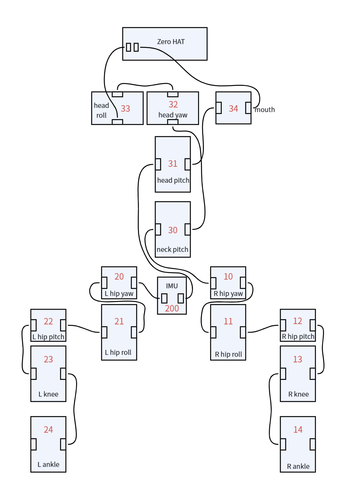

# OpenMicroDuck 文档

本目录是硬件与软件规划的入口。当前选型：


| 项目  | 当前选择                                      | 详细文档                                     |
| --- | ----------------------------------------- | ---------------------------------------- |
| 架构  | 几何与控制契约对齐 Microduck；供应链换成可公开打样的国产件        | [architecture.md](architecture.md)       |
| 主控  | **Radxa ZERO 3W**（RK3566，≥1 GB，有 eMMC 更好） | [main_controller.md](main_controller.md) |
| 舵机  | **飞特 HD-1910-C001** × 15                  | [servo.md](servo.md)                     |


条目索引与外部链接见 [reference.md](reference.md)。

证据分级与各篇正文相同：**官方** / **源码还原** / **规划** / **未定**。本文是摘要，数字与接口以对应长文为准。

---

## 1. 架构 — [architecture.md](architecture.md)

软件与硬件如何拼在一起：策略在哪训练、模型长什么样、板载如何采样 / 推理 / 驱动电机与扬声器。

**软件架构不区分 Microduck 与本仓库。** 两边走同一条 sim-to-real 回路：离线训出 ONNX，板上 50 Hz 闭环执行。差别在执行器品牌、电池、哪些 PCB 开源。

### 软件（通用）

- 训练不在机器人上：`microduck_rl` 用 mjlab（MuJoCo Warp）+ PPO；执行器模型（BAM）和域随机化决定能否上真机。
- 运动策略是 **ONNX**，契约 **观测 61 维 → 动作 14 维 @ 50 Hz**。嘴是第 15 轴，由上层逻辑开合，不进策略。
- 摄像头和 8×8 ToF **不进入**标准行走策略；感知侧只把几十字节特征喂给行为层。
- 板载七个守护进程 + `robotctl`，Unix socket 上 JSON-RPC。**只有 `robotd` 能写电机。**
- 走路在 CPU 上跑 ONNX Runtime；NPU 留给视觉检测，不进平衡环。

### 硬件（规划）

目标：25 cm、15 DoF、50 Hz、61/14；机械图纸、PCB、BOM 按 CERN-OHL-S 发布。


| 模块       | 规划                                        |
| -------- | ----------------------------------------- |
| 计算主控     | RK3566 同级；当前落地先用 Radxa ZERO 3W，见下文        |
| 舵机 ×15   | 飞特 TTL 半双工、带位置/速度/电流反馈；当前落地选 HD-1910-C001 |
| 机身 IMU   | 自制 `imu_to_ft`，挂在舵机总线上，从机 ID 200          |
| 头部 IMU   | I²C 辅助模组，**不进** 50 Hz 平衡环                 |
| 相机 / ToF | CSI 模组 + 8×8 DToF（I²C）                    |
| 电池       | 当前用NP-F550复现                              |


换舵机或改质量分布之后，官方 ONNX **不能当即插即用步态**；要在 `microduck_rl` 里按新执行器重训，并保持 `obs[61] → act[14]`。

---

## 2. 主控 — [main_controller.md](main_controller.md)

**当前选择：Radxa ZERO 3W。**

与官方 Microduck 开发栈差异最小：设备树 `compatible = "radxa,zero-3w"`，overlay、NPU 脚本、HAT 针脚都按这块板写过。优先买 **≥1 GB RAM、有 eMMC** 的那档（官方机是 1 GB + 32 GB eMMC）。


*图：正反面接口。来源：[Radxa ZERO 3 文档](https://docs.radxa.com/zero/zero3)。*


| 项目      | ZERO 3W                                                |
| ------- | ------------------------------------------------------ |
| 尺寸      | 65 mm × 30 mm（Pi Zero 同外形）                             |
| SoC     | RK3566，四核 A55 @ 最高 1.6 GHz                             |
| AI      | NPU 0.8 TOPS（INT8）；走路不用，视觉检测用                          |
| 内存 / 存储 | 1–8 GB LPDDR4；可选 eMMC + microSD                        |
| 无线      | Wi-Fi 6 + BT 5.4                                       |
| 和鸭子相关的口 | UART2 → 舵机总线；I²C3 → ToF / codec；MIPI CSI → 相机；I²S → 喇叭 |


验收三件事：50 Hz 跑完 ORT 且 CPU 有余量；HAT 上同时拿出 UART + I²C + I²S（3.3 V）；有可用 CSI。

同系列 **ZERO 3E** 用网口换掉无线，除非外挂 Wi-Fi / BT，否则不合适。Armbian 默认在 UART2 开 `serial-getty`，不 mask 会占死舵机总线。

详细文档还列了其它 RK3566 模组、CM4 核心板、RK3568、进迭时空 K1 等平替路径；那些是缺货或改载板或升级时的备选，**不是当前默认件**。

---

## 3. 舵机 — [servo.md](servo.md)

**当前选择：飞特 HD-1910-C001**（产品页 / 对照表亦作 HD-1910；外形图文件名为 `HD-1910M-C001`）。

Microduck 运行时按 Dynamixel XL330-M288-T 说话。HD-1910-C001 是飞特为开源小鸭做的预售款：磁编码、恒力、TTL 菊花链，电压 **5–8.4 V**，比 XL330 的 5 V 上限更适合 2S 锂电 / 18650。换型号必须 **重训** 策略。


| 项目    | HD-1910-C001（当前选择）             | XL330-M288-T（官方基线）           |
| ----- | ------------------------------ | ---------------------------- |
| 重量    | 22.5 ± 2 g                     | 18 g                         |
| 尺寸 mm | 34 × 20 × 23                   | 20 × 34 × 26                 |
| 堵转扭矩  | 10 kg·cm（0.98 N·m）             | 0.52 N·m @ 5 V               |
| 额定扭矩  | 3.0 kg·cm（0.29 N·m）            | 未给                           |
| 空载转速  | 110 rpm                        | 103 rpm @ 5 V                |
| 供电    | **5–8.4 V**                    | 3.7–6.0 V（推荐 5 V）            |
| 接口    | AMP-3：1 GND / 2 Vcc / 3 Signal | JST 3P TTL                   |
| 协议    | 飞特 TTL 半双工                     | Dynamixel 2.0                |
| 反馈    | 负载 / 位置 / 速度 / 电压 / 电流 / 温度    | 位置 / 速度 / 电流 / PWM / 电压 / 温度 |


总线规划与官方运行时对齐，便于沿用观测布局（嘴仍是策略外的第 15 轴）。板上 UART 与舵机都应跑在 **1 Mbps**；出厂若不是这个波特率，要在初始化里改过去。

### 舵机连线

15 颗 HD-1910-C001 + 机身 IMU 挂在 Zero HAT 引出的同一条 TTL 半双工总线上，菊花链分叉如下。



```text
Zero HAT
  ├─ 34 mouth
  └─ 33 head_roll → 32 head_yaw → 31 head_pitch → 30 neck_pitch
                                              ├─ 20 L hip yaw → 21 roll → 22 pitch → 23 knee → 24 ankle
                                              ├─ 10 R hip yaw → 11 roll → 12 pitch → 13 knee → 14 ankle
                                              └─ 200 IMU（跨接在左右髋之间）
```

ID 规划：

```text
右腿          10 right_hip_yaw · 11 right_hip_roll · 12 right_hip_pitch · 13 right_knee · 14 right_ankle
左腿          20 left_hip_yaw  · 21 left_hip_roll  · 22 left_hip_pitch  · 23 left_knee  · 24 left_ankle
颈 / 头 / 嘴  30 neck_pitch    · 31 head_pitch     · 32 head_yaw        · 33 head_roll  · 34 mouth
机身 IMU      200
```

宇树 YS-342026-S288、伺泰威 ED330、飞特 HL-2915 等对照见 [servo.md](servo.md) §3；那些是候选，**不是当前默认件**。