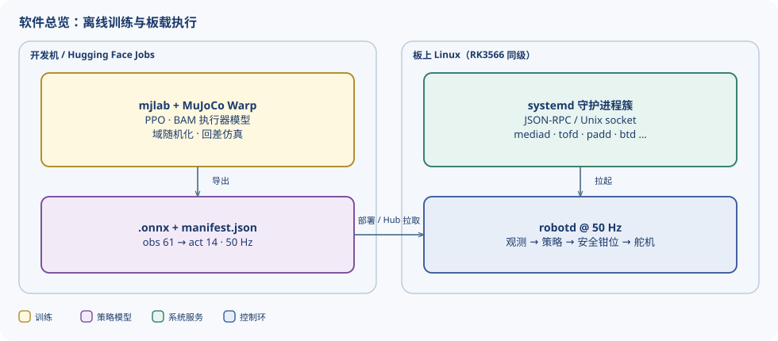
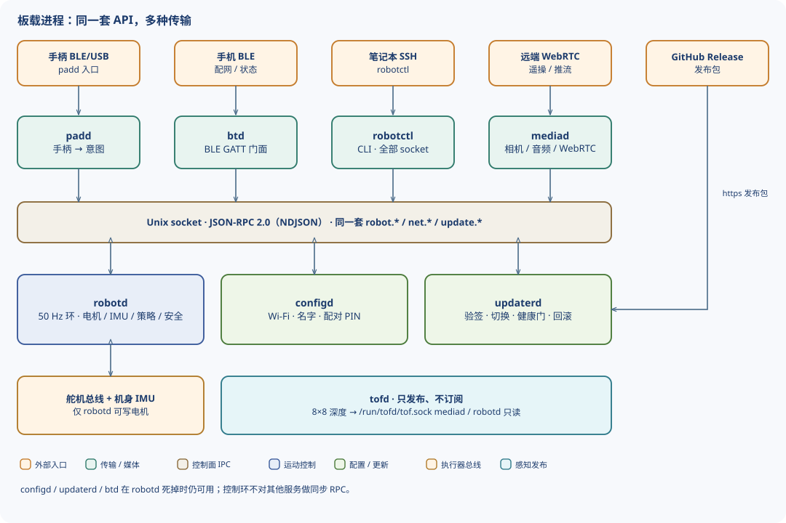
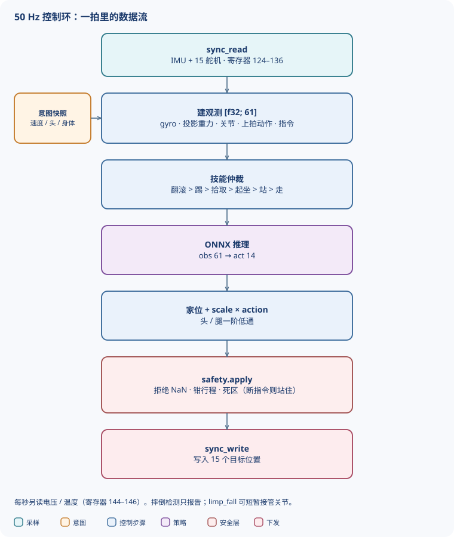
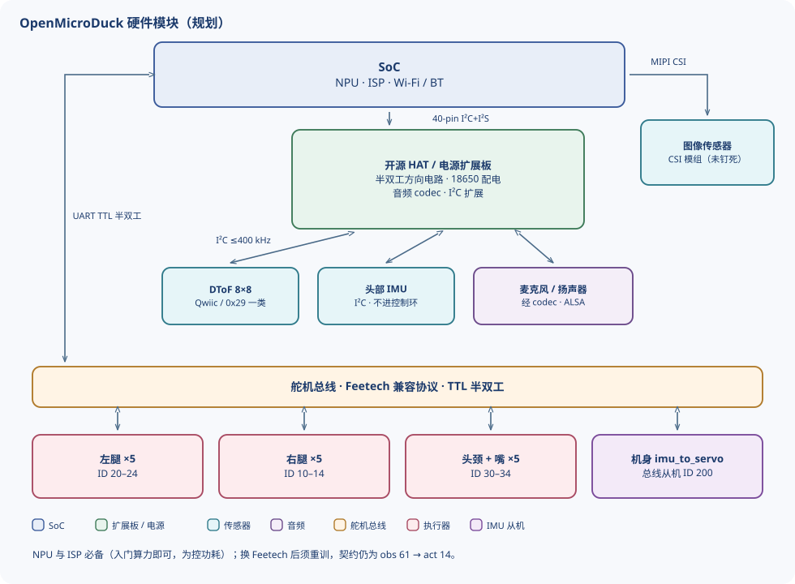
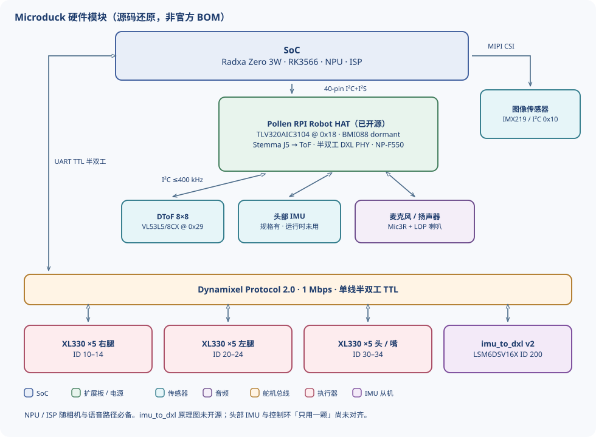

# OpenMicroDuck / Microduck 架构

本文整理软件与硬件如何拼在一起：策略在哪训练、模型长什么样、板载如何采样 / 推理 / 驱动电机与扬声器，以及各模块靠什么接口通信。

**软件架构不区分 Microduck 与本仓库规划。** 两边走同一条 sim-to-real 回路：离线训出 ONNX，板上 50 Hz 闭环执行。硬件选型、电源与开源边界不同，见后两节。

证据分级：


| 标记       | 含义                                                             |
| -------- | -------------------------------------------------------------- |
| **官方**   | 产品页、新闻稿，或 `pollen-robotics/microduck` / `microduck_rl` 源码与设计文档 |
| **源码还原** | 运行时写死的设备路径、I²C 地址、寄存器；社区据此还原，非官方 BOM                           |
| **规划**   | 本仓库 README 与规划文档                                     |
| **未定**   | 公开材料互相矛盾，或量产件尚未冻结                                              |


条目来源见 `[reference.md](reference.md)`。Microduck 机械 / 整机电控并未作为开源硬件发布；HAT 板除外。

---


## 1. 软件架构（通用）

整条链路是「离线训、板上跑、意图进、安全层出」。摄像头图像和 8×8 ToF **不进入**标准行走策略；它们走感知侧，只把几十字节的特征喂给行为层。



### 1.1 训练在哪做

训练不在机器人上。官方仓库 `[microduck_rl](https://github.com/pollen-robotics/microduck_rl)` 用 **mjlab（MuJoCo Warp）+ PPO**。需要 CUDA；没有本地 GPU 时可用 Hugging Face Jobs。

训练里真正决定能否上真机的，是执行器模型而不是视觉：

- **BAM M6**：按 Dynamixel XL330 的电压控制律、反电动势、库仑 / Stribeck / 负载相关摩擦建模。
- **域随机化**：电池电压、负载压降、指令延迟、摩擦系数。
- **回差变体**：每个关节串联 ±1° 齿轮间隙；观测读的是编码器侧（间隙之后），与真机一致。

任务按技能拆开（走、站、起坐、地面拾取、踢球、翻滚、轮滑等），但观测宽度统一，所以运行时可以热切换网络。社区可在 Mac / DGX Spark / Isaac Lab / Genesis 上复训，契约仍是同一套 61 / 14。

仿真网页沙盒（Hugging Face Space）用 MuJoCo WASM + onnxruntime-web，同样 50 Hz 跑真实策略，用来验图、不替代训练。

### 1.2 生成的模型是什么样的

运动策略是 **ONNX**，不是 PyTorch 权重直接上机。导出脚本把观测归一化烘焙进图；手转 checkpoint 会让策略看到未归一化输入。

契约（加载时校验，形状不对则拒绝）：


|     | 维数        | 内容                                                                                                         |
| --- | --------- | ---------------------------------------------------------------------------------------------------------- |
| 观测  | **61**    | `gyro(3)` + `projected_gravity(3)` + `joint_pos(14)` + `joint_vel(14)` + `last_action(14)` + `command(13)` |
| 动作  | **14**    | 14 个关节目标；**嘴舵机不在策略里**                                                                                      |
| 频率  | **50 Hz** | 与控制环同一拍                                                                                                    |


`command(13)` = 速度指令 `vx, vy, vyaw`（3）+ 头目标 4 + 身体姿态 6。身体块里 x / y / yaw 在训练中未绑定，标称全零。

嘴（第 15 个舵机）由上层逻辑开合（拾取、合唱口型、特雷门等），动作向量写回 15 槽时该位置保持 0。

官方策略按槽位发布（走、站、起坐、左右踢、地面拾取、翻滚、轮滑等），Hub 仓库一份 `.onnx` + `manifest.json`（观测/动作维、`model_api`、机型兼容性）。板上三个来源填同一个槽：官方组件、社区 Hub、本地路径。

视觉检测是另一类模型：`duck_detector` 训出的 **INT8** `.rknn`（例：YOLO11n 320×320），跑在 RK3566 NPU 上，**不**进 50 Hz 运动环。仓库对外 404，板上路径设计为挂在 `mediad` 里。

音频不是神经网络：每台机器用 SoC 序列号生成确定性「性格」种子，合成一套叫声 bank（chirp / greet / coo 等），不是 TTS。

### 1.3 模型在哪运行

运动 ONNX 在板上由 `robotd` **用 ONNX Runtime** `dlopen` **推理**，每拍一次。ORT 是板级依赖，不打进发布包。

感知在传感器旁边：


| 模型 / 功能                              | 进程            | 加速器          |
| ------------------------------------ | ------------- | ------------ |
| 运动策略 `.onnx`                         | `robotd`      | CPU（ORT）     |
| 鸭子检测 `.rknn`                         | 设计落在 `mediad` | NPU 0.8 TOPS |
| 麦克风宠物检测（约 20 KB CNN，40-band log-mel） | `robotd` 工作线程 | CPU          |


原则：**给控制环的是特征，不是帧。** `robotd` 不订阅 640×480 RGB；它读「球在 (x,y)」「附近有鸭子」这类几十字节、10–30 Hz 的快照。帧卡在 `mediad`，控制环卡不住。

### 1.4 板载进程如何拼在一起

七个守护进程 + 一个 CLI，Unix socket 上 **JSON-RPC 2.0（NDJSON，一行一个对象）**。`systemd` 管生命周期。




| 进程         | 拥有                     | 监听                    | 对外                                    |
| ---------- | ---------------------- | --------------------- | ------------------------------------- |
| `robotd`   | 电机、机身 IMU、策略、安全、健康     | `/run/robotd.sock`    | Dynamixel（或兼容）总线                      |
| `configd`  | Wi-Fi、名字、配对 PIN、手柄绑定   | `/run/configd.sock`   | BlueZ / NetworkManager（D-Bus）         |
| `updaterd` | 发布包验签、原子切换、回滚          | `/run/updaterd.sock`  | GitHub、`systemctl`、`robot.health`     |
| `btd`      | 无状态，BLE 门面             | GATT                  | 转发给 `robotd` / `configd` / `updaterd` |
| `padd`     | 无状态，手柄 → 意图            | `/run/padd/pad.sock`  | `robotd`                              |
| `mediad`   | 摄像头、麦克风、编码、WebRTC、远端网关 | TCP `:8080` / `:8443` | 转发给上述服务                               |
| `tofd`     | 头上 ToF                 | `/run/tofd/tof.sock`  | HAT 上的 I²C                            |
| `robotctl` | CLI                    | —                     | 所有 socket                             |


不变量：

1. **只有** `robotd` **能写电机。** 客户端发意图（「这个速度走」「看那边」「坐下」），安全层决定是否执行。
2. `configd` **/** `updaterd` **/** `btd` **在** `robotd` **死掉时仍可用** —— 这是恢复路径。
3. **控制环不对其他服务做同步 RPC。** 跨进程读是 last-value-wins 缓存。
4. **控制面走 socket；视频/音频帧不走 socket。** 真要跨进程传帧，才用 shm / dmabuf。

远端同一套 API、多种传输：BLE（子集）、Unix socket、WebSocket（给 LLM：按需 JPEG，不要 30 fps）、WebRTC datachannel（遥操）。WebRTC 里 `control` 可靠有序，`teleop` 不可靠无序 —— 重传 80 ms 前的摇杆指令比丢掉更糟。

### 1.5 一拍里发生什么（传感器 → 决策 → 电机）

50 Hz，每拍两次总线事务，每秒一次慢采样：



每秒另读电压 / 温度（寄存器 144–146）。电压是 15 个舵机供电的平均（没有电量计）；温度按关节上报，取最热的那个名字。

摔倒分两层：投影重力 mag 过阈值并 debounce，只用于报告；`limp_fall` 用陀螺预测即将着地，短暂接管关节、卸力、再交回站立策略。摔倒本身不禁止 `enable` / 技能 —— 躺着的时候更需要这些调用能用。

### 1.6 各传感器如何进软件


| 数据                   | 谁读                                       | 频率        | 进运动策略？                      |
| -------------------- | ---------------------------------------- | --------- | --------------------------- |
| 关节位置 / 速度 / PWM / 电流 | `robotd` 一次 `sync_read`                  | 50 Hz     | 是（14 关节）                    |
| 机身 IMU：陀螺 + SFLP 四元数 | 同一趟 `sync_read`（总线 ID 200）               | 50 Hz     | 是（gyro + projected gravity） |
| 电池电压、舵机温度            | `robotd` 慢采样                             | 1 Hz      | 否（电压自适应缩放可选）                |
| 8×8 ToF              | `tofd` → socket 订阅                       | ~15 Hz    | 否；特雷门、避障、高层行为用              |
| 摄像头                  | `mediad`（ISP + MPP H.264）                | 默认 720p30 | 否；检测结果作特征                   |
| 麦克风                  | codec → ALSA；`mediad` 推流，`pet-detect` 另读 | 音频速率      | 否                           |
| 头部 IMU               | 产品规格有；当前运行时控制环不用                         | —         | 否                           |
| SoC 温度               | `robotd` 读 sysfs                         | 1 Hz      | 否                           |


里程计在环内算：足端接触 + IMU 航向。没有磁力计，航向会漂，调用方按相对运动用。

### 1.7 扬声器如何发声

声音不经策略网络。

1. 安装时 `sounds ensure-bank` 用 SoC 序列号生成种子，渲染该机独有的叫声 bank。
2. `robotd` 里 `sound.rs` 拉起一个 `aplay` 子进程；codec 的 PCM 独占，新叫声杀掉旧的。
3. 播放走 ALSA 设备（开发路径上是 `plughw:aic3104`）。喇叭挂在 codec 的 line-out（LEFT_LOP / RIGHT_LOP）。
4. 合唱：多机 BLE 信标选最低 ID 当指挥；`btd` 只搬信标，不决策。合唱会动嘴和头，所以默认关闭。
5. 特雷门：`tofd` 的深度 → 音高 + 嘴开度，50 Hz 环只采样、不等待。

WebRTC 会话可以双向带麦克风和喇叭，用于遥在；本地叫声和远端音频抢同一条 PCM。

---


## 2. 硬件模块架构

两边都是：RK3566 同级 Linux 板 + 扩展板（电源 / 音频 / I²C）+ 一条半双工舵机总线 + 头上的相机 / ToF。差别在执行器品牌、电池、哪些 PCB 开源。

### 2.1 我们规划的架构（OpenMicroDuck）

目标：几何与控制契约对齐 Microduck（25 cm、15 DoF、50 Hz、61/14），供应链换成可公开打样、可替代的国产件。机械图纸、PCB、BOM 按 CERN-OHL-S 发布。

规格（规划，未冻结）：


| 项目  | 规划                                      |
| --- | --------------------------------------- |
| 整机  | 25 cm / ≤1 kg                           |
| 自由度 | 15（腿 5×2 + 头颈 4 + 鸭嘴 1）                 |
| 舵机  | 15 × **Feetech 协议平替**（TTL 半双工、带位置/速度反馈） |
| 主控  | **RK3566 同级**（不绑定某一款模块，兼容性矩阵另发）         |
| 电池  | **可拆 18650 电池组**                        |
| 结构  | 3D 打印（FDM / 光固化）+ 钣金                    |
| 控制  | 50 Hz 板载策略环；训练仍用 MuJoCo / PPO           |




#### 模块与接口（规划）


| 模块     | 规划形态                              | 物理接口                         | 协议                                                        | 备注                                          |
| ------ | --------------------------------- | ---------------------------- | --------------------------------------------------------- | ------------------------------------------- |
| 计算主控   | RK3566 同级 SBC                     | 40-pin、CSI、UART、USB-C        | Linux 外设                                                  | 不绑定 Radxa；要能跑 50 Hz ORT + 可选推流              |
| 舵机 ×15 | Feetech 平替                        | 3 线：GND / 电源 / DATA          | 厂家 TTL 总线（与 Dynamixel 类似的半双工包）                            | 换执行器必须 **重训** 策略；官方 ONNX 不能当 bit-exact 用    |
| 机身 IMU | `imu_to_ft` 自制板 | 挂在舵机总线上                      | 规划对齐官方从机：ID 200、1 Mbps、寄存器 124 起 12 字节（陀螺 i16 + 四元数 fp16） | MCU + LSM6DSV16X（SFLP）+ 半双工 PHY；控制环不在主机上做融合 |
| 头部 IMU | 小 I²C 模组 | 4 针：GND / 3V3 / SDA / SCL    | I²C ≤400 kHz                                              | **不进平衡环**；与 ToF 共总线，注意地址                    |
| 图像传感器  | CSI 摄像头模组                         | MIPI CSI（控制常走 I²C `0x10` 一类） | CSI-2 + I²C                                               | 具体传感器未钉死；软件侧按「感知在 `mediad`」接                |
| DToF   | 8×8 多区 ToF                        | Qwiic / Stemma 类 3.3 V I²C   | I²C，常见地址 `0x29`                                           | VL53L5CX / L8CX 一类；`tofd` 发布矩阵              |
| 麦克风    | MEMS，经 codec 或板载                  | I²S 数据 + I²C 控制              | ALSA                                                      | 可与官方 HAT 路线兼容，或换国产 codec                    |
| 扬声器    | 小喇叭                               | codec line-out / 功放          | I²S → 模拟                                                  | `aplay` 播预渲染 bank                           |
| 电源     | 18650 可拆组                         | HAT 作配电                      | —                                                         | 与官方 NP-F550 不同；需自管充电、过放、舵机供电轨               |


舵机 ID 规划与官方运行时对齐，便于沿用观测布局（嘴仍是策略外的第 15 轴）：

```text
右腿  10–14    左腿  20–24    颈/头/嘴  30–34    机身 IMU  200
```

HAT 需要至少三件事：舵机半双工方向电路、电池配电、I²C/I²S 外设。官方 `[elec_RPI_Robot_HAT](https://github.com/pollen-robotics/elec_RPI_Robot_HAT)` 已开源且标明可驱动 Dynamixel **或 Feetech**（线序可能要改），可作第一版参考，再按 18650 与国产件重画。

与官方栈的关系：主控同级、总线从机行为对齐时，可直接跑 Apache-2.0 的 `robotd` 一族。Feetech 寄存器 / 波特率 / 力矩曲线不同，则要在 `RobotIo` 下加驱动，并用 `microduck_rl` 按新 BAM（或实测执行器）重训。

---


### 2.2 推测的 Microduck 架构

产品规格只钉到「RK3566、15 电机、相机、LiDAR、双 IMU」。下面到芯片 / 连接器这一层，来自 **公开运行时、设备树、HAT 开源仓** 的还原，**不是** Pollen 发布的量产 BOM。量产前仍可能改。尚未有可核对的零售机拆解。

整机（官方）：高 25 cm、宽 14 cm、<800 g；15 DoF；50 Hz 策略环；电池 NP-F550 2600 mAh；Wi-Fi + 蓝牙；NFC 双天线（头 + 喙，控制器未公开）。



#### 模块、接口、协议


| 模块          | 推测 / 还原型号                                                  | 接口                                      | 协议                                         | 证据                                                          |
| ----------- | ---------------------------------------------------------- | --------------------------------------- | ------------------------------------------ | ----------------------------------------------------------- |
| 计算主控        | **Radxa Zero 3W**（RK3566，四核 A55 + Mali-G52 + NPU 0.8 TOPS） | CSI、40-pin、UART2、板载 Wi-Fi/BT            | Linux                                      | 设备树 `compatible = "radxa,zero-3w"`；产品规格钉 SoC / 1G+32G       |
| 舵机 ×15      | **ROBOTIS Dynamixel XL330**（社区多指向 M288-T 一类）               | 3 线 TTL：GND / VDD / DATA                | **Protocol 2.0，1 Mbps**                    | `robotd` 总线文档；`rustypot` 寄存器表                               |
| 半双工 PHY     | 在 HAT 上                                                    | UART TX/RX → 单线 DATA                    | 硬件自动换向（源码无方向 GPIO）                         | HAT README：TTL 与 485 都做了                                    |
| 机身 IMU      | **ST LSM6DSV16X** 在自制 `imu_to_dxl` v2                      | 与舵机同一 UART                              | DXL 从机 **ID 200**；`sync_read` 地址 124、12 字节 | `duck-control` IMU 代码。板子原理图 **未开源**                         |
| HAT 上第二 IMU | **Bosch BMI088**                                           | I²C `0x19` / `0x68`                     | I²C                                        | 焊着，源码写 unused / dormant                                     |
| 头部 IMU      | 产品规格「头 + 身体各一」                                             | 未公开                                     | 未进入当前 `robotd` 控制环                         | 官方规格 vs 源码「One IMU, one code path」—— **未对齐**                |
| 图像传感器       | **Sony IMX219**（Pi Camera v2 路径）                           | MIPI CSI + I²C `0x10`                   | CSI-2；1080p30 传感器模式，ISP 缩到 720p30          | `mediad` / 设备树。量产镜头 **未冻结**（新闻稿）                            |
| DToF        | **VL53L5CX 或 VL53L8CX**（8×8）                               | HAT Stemma J5，I²C `0x29`                | I²C，上电要灌约 90 KB 固件                         | `tofd`；两代芯片源码都支持，量产哪颗 **未钉**                                |
| 音频 codec    | **TI TLV320AIC3104**                                       | I²C `0x18` 控制 + **I²S3** 数据；MCLK 12 MHz | I²C + I²S，ALSA 卡名 `aic3104`                | 设备树 overlay                                                 |
| 麦克风         | HAT 板载 MEMS，走 Mic3R                                        | 模拟 → codec PGA                          | —                                          | 具体料号未公开                                                     |
| 扬声器         | 接 codec LOP                                                | 模拟                                      | —                                          | 料号未公开                                                       |
| NFC         | 双天线：头 + 喙                                                  | 未公开                                     | 未公开                                        | 仅产品规格；运行时源码无提及                                              |
| 电池          | **Sony NP-F550**，2S，标称 7.2 V                               | 经 HAT 配电                                | 无电量计；电压 = 舵机回报的总线电压                        | 官方规格 + 运行时注释。零售 XL330 额定 3.7–6.0 V，与 2S 直供 **如何匹配尚未被量产机证实** |


舵机 ID（官方控制环）：

```text
imu_to_dxl    200
左腿          20 hip_yaw · 21 hip_roll · 22 hip_pitch · 23 knee · 24 ankle
右腿          10–14（镜像）
颈 / 头 / 嘴  30 neck_pitch · 31 head_pitch · 32 head_yaw · 33 head_roll · 34 mouth
```

`imu_to_dxl` 12 字节块（与 15 个舵机同一趟读，主机不做融合）：


| 偏移   | 内容                                                      |
| ---- | ------------------------------------------------------- |
| 0–5  | 陀螺 x/y/z，`i16` LE，±500 dps                              |
| 6–11 | SFLP 四元数 x/y/z，IEEE binary16；`w` 在主机用 `√(1−x²−y²−z²)` 补 |


HAT 上 I²C3 占用 40-pin 的 3/5。Radxa 原厂把同一控制器的 M1 给了 USB-C PD（FUSB302）；官方 overlay 改到 M0 后 **失去 PD 协商**，普通 5 V 充电仍可用。Armbian 默认在 UART2 开 `serial-getty`，不 mask 就会把整条舵机总线占死。

#### 和「双 IMU」的关系

新闻稿写身体、头部各一颗 IMU。源码控制环只认总线上的 LSM6DSV16X。HAT 的 BMI088 明确休眠。头部那颗更像交互 / 头姿辅助，或量产与开发板不一致。复刻平衡环时，**不要**把第二颗 IMU 当成 50 Hz 观测的一部分。

#### 开源边界（官方立场）


| 开源                                      | 未作为开源硬件发布         |
| --------------------------------------- | ----------------- |
| 板载软件（Apache-2.0）                        | 可编辑机械 CAD、整机装配文档  |
| `microduck_rl` 与 ONNX 策略                | `imu_to_dxl` 原理图  |
| 仿真 MJCF + 训练用 STL                       | 量产 BOM、线束图        |
| **RPI Robot HAT**（KiCad / Gerber / BOM） | NFC 控制器；部分传感器量产料号 |


---


## 3. 对照摘要


|          | OpenMicroDuck（规划）                      | Microduck（公开材料 + 源码还原）         |
| -------- | -------------------------------------- | ------------------------------ |
| 软件       | 同一套：PPO 离线训 → ONNX → 板上 50 Hz `robotd` | 同左（官方实现）                       |
| 主控       | RK3566 **同级**，不绑模块                     | 产品：RK3566；开发板还原为 Radxa Zero 3W |
| 舵机       | Feetech 平替                             | Dynamixel XL330                |
| 机身 IMU   | 自制 `imu_to_ft`，行为对齐 ID 200            | 同结构，原理图未开源                     |
| 头部 IMU   | I²C 辅助模组，不进控制环                         | 规格有；运行时未用                      |
| ToF / 相机 | 同角色（I²C 8×8 + CSI）                     | VL53L5/8CX + IMX219 路径         |
| 电池       | 18650 可拆组                              | NP-F550                        |
| 硬件开源     | 图纸 / PCB / BOM 全公开                     | 仅 HAT + 软件；整机不称开源硬件            |


换舵机或改质量分布之后，官方 9 个 ONNX 不能当即插即用步态；要在 `microduck_rl` 里按新执行器重训，并保持 `obs[61] → act[14]`，才能继续热切换技能。

---


## 4. 主要来源

- 官方运行时架构：[https://github.com/pollen-robotics/microduck/blob/main/docs/design/architecture.md](https://github.com/pollen-robotics/microduck/blob/main/docs/design/architecture.md)
- 控制环与总线：[https://github.com/pollen-robotics/microduck/blob/main/docs/design/robotd-design.md](https://github.com/pollen-robotics/microduck/blob/main/docs/design/robotd-design.md)
- 策略通道：[https://github.com/pollen-robotics/microduck/blob/main/docs/design/policy-channel-design.md](https://github.com/pollen-robotics/microduck/blob/main/docs/design/policy-channel-design.md)
- 训练：[https://github.com/pollen-robotics/microduck_rl](https://github.com/pollen-robotics/microduck_rl)
- HAT：[https://github.com/pollen-robotics/elec_RPI_Robot_HAT](https://github.com/pollen-robotics/elec_RPI_Robot_HAT)
- 产品规格：[https://pollen-robotics.com/microduck/press-kit/](https://pollen-robotics.com/microduck/press-kit/)
- 条目索引：`[reference.md](reference.md)`

