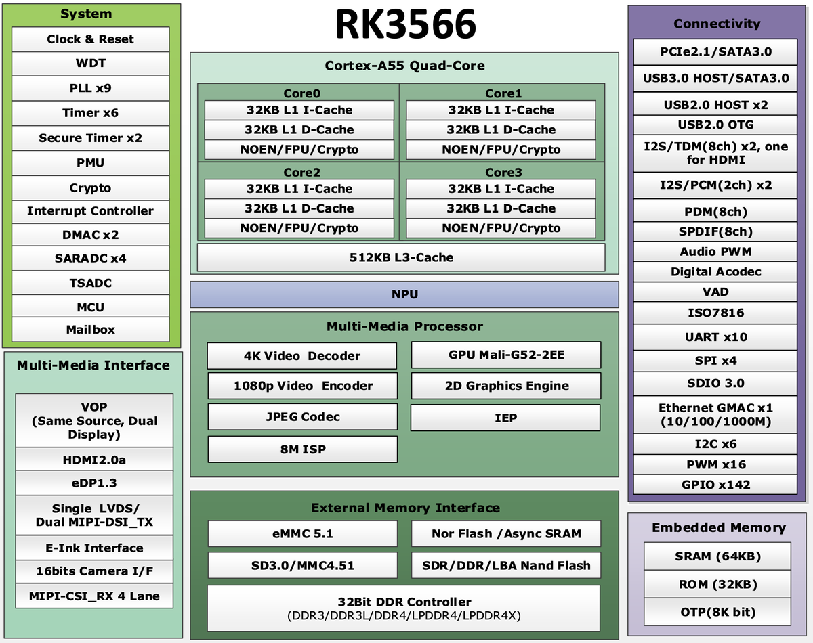
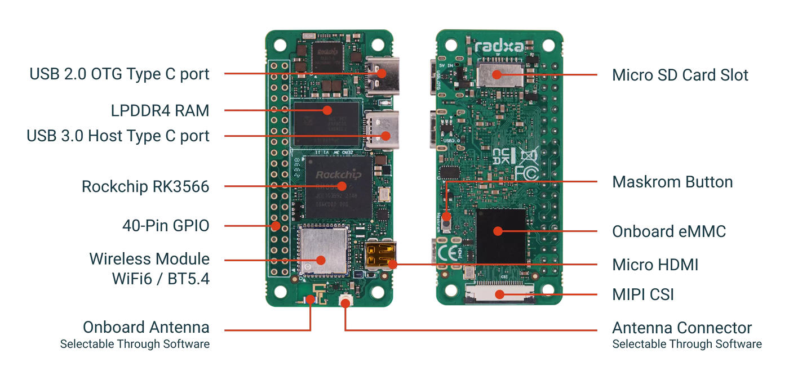
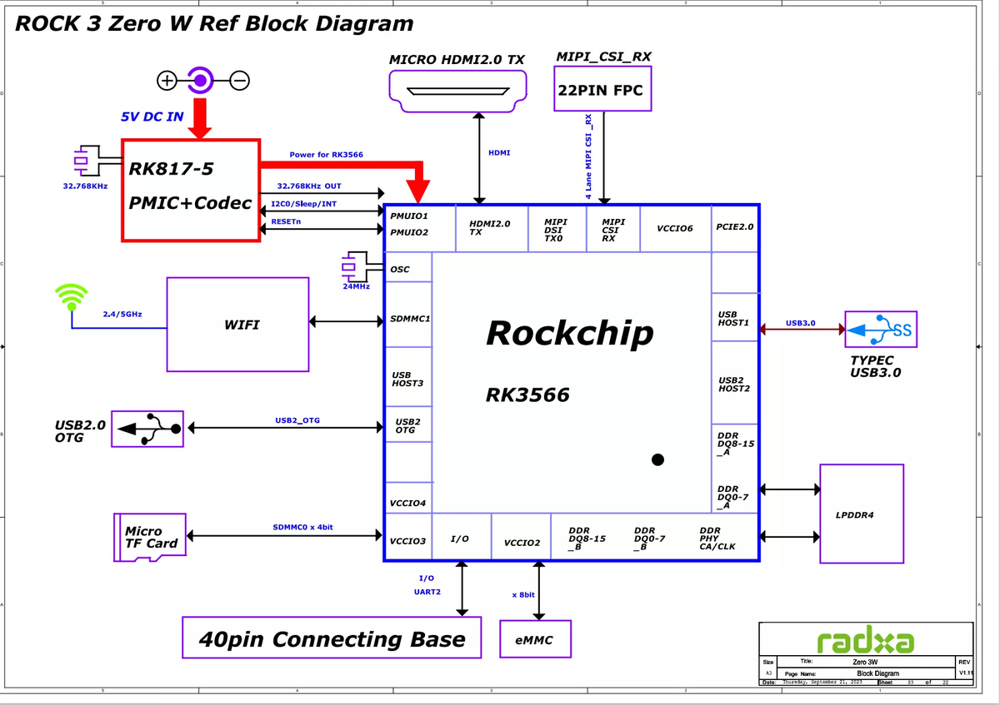

# 主控选型

本文说明 OpenMicroDuck 的主控选型逻辑，并对照 Microduck 实际用的计算板、SoC 能提供什么、按什么标准找平替。

证据分级与 `[architecture.md](architecture.md)` 相同：

| 标记       | 含义                                                   |
| -------- | ---------------------------------------------------- |
| **官方**   | 产品规格、芯片手册、板厂文档，或 `pollen-robotics/microduck` 源码与设计文档 |
| **源码还原** | 设备树、运行时写死的路径与板级脚本                                    |
| **规划**   | 本仓库的选型原则，尚未冻结兼容性矩阵                                   |
| **未定**   | 公开材料互相矛盾，或量产件尚未冻结                                    |

NPU 相关只引用 **Pollen / Hugging Face 官方仓** 能交叉核对的内容；走路策略以 Hub 上的 `.onnx` 为准。见 §5。

---

## 1. 主控选型（规划）

尚未做兼容性矩阵。当前倾向：

| 优先级 | 选择                                                 | 原因                                            |
| --- | -------------------------------------------------- | --------------------------------------------- |
| 1   | 能买到的 **Radxa ZERO 3W**（≥1 GB，有 eMMC 更好）            | 与官方栈差异最小                                      |
| 2   | 其它 **RK3566** Zero 模组，或 **CM4 兼容核心板**（如 Radxa CM3） | 同族 NPU 与相机；载板反正要重画                            |
| 3   | **RK3568** 开发板（不限外形）                               | 先把 `robotd` / `mediad` / RKNN 在同族芯片上跑通        |
| 4   | **进迭时空 K1** 开发板（不限外形）                              | RISC-V 八核、AI 2.0 TOPS；要重编 riscv64 栈，并核功耗 / 散热 |
| 5   | **Pi Zero 2W** / 原版 **Pi CM4**                     | 机械资料熟；RAM 与 NPU 要按能力降级预期                      |

最快的办法是 **直接买 Radxa ZERO 3W**，而且尽量靠近官方那档 1 GB + 32 GB eMMC：设备树、overlay、NPU 脚本、HAT 针脚都已经按这块板写过。但这块板现在常缺货、溢价。长远看，OpenMicroDuck **不把某一 SKU 写进规范**。能接近，就可以做方案。接近分两条，可以只满足一条，最好两条都沾边：

1. **外形足够小**：能塞进头或身体。Zero（约 65×30 mm）和 **CM4 兼容核心板**（约 55×40 mm）都够小。HAT / 转接板反正要重画，不必死守 40-pin Zero 针脚。
2. **SoC 性能接近**：四核 A55 同级（或更强）即可，**不绑定 aarch64**；要有可用的板载 AI 加速（RKNN 或同级）、CSI 和足够 RAM。RISC-V 如进迭时空 K1 也在候选里，见 §7。

40-pin 或 CM4 座都只保证机械上能接。UART / I²C 落在哪根脚、设备树 overlay、CSI 针脚定义，每家板都要单独核。官方 HAT 标明可驱动 Dynamixel **或 Feetech**，并不等于任意核心板插上就能跑。

验收可以先问三件事：

1. 能否在 50 Hz 跑完 ORT，且 CPU 还有余量给总线和安全层。
2. 载板（40-pin 或 CM4 座）上能否同时拿出 **UART（舵机）+ I²C（ToF / 头 IMU）+ I²S（喇叭）**，电压 3.3 V。
3. 是否有可用的 CSI（或接受 USB 相机，那就要改 `mediad`）。

**NPU（或同级的板载 AI 算力）是视觉等 AI 功能的必须，不是强化学习走路的门槛。** 官方步态是 ONNX，在 CPU 上用 ONNX Runtime 跑；鸭子检测一类感知在官方栈里走 RKNN。换 SoC 可以换加速栈，但不能没有这块算力。

---

## 2. Microduck 用的是什么

产品规格钉的是 **Rockchip RK3566 + AI 加速器**，内存 **1 GB RAM / 32 GB 存储**（**官方**：[新闻稿套件](https://pollen-robotics.com/microduck/press-kit/)、[商店页](https://store.pollen-robotics.com/products/microduck)）。规格没有写板厂型号。

板上软件把目标写死成 **Radxa Zero 3**（RK3566，Armbian，Debian Trixie 用户态）。设备树 `compatible = "radxa,zero-3w"`，对应市售 **Radxa ZERO 3W**，不是定制载板（**源码还原**：运行时仓库、`[updater-design.md](https://github.com/pollen-robotics/microduck/blob/main/docs/design/updater-design.md)`）。

Microduck 这套 SKU（1 GB + 32 GB eMMC）正好是 Zero 3W 的一档现成配置。

OpenMicroDuck 的立场不同：主控只要 **RK3566 同级**，能跑 50 Hz ONNX Runtime 控制环，并接上 40-pin HAT / CSI / UART。见 `[architecture.md](architecture.md)` §2.1。

---

## 3. RK3566 基本参数

RK3566 是瑞芯微 2020–2021 年的入门级 AIoT SoC。下表以芯片手册为准；板上实际主频、内存容量由模组决定。

*图：RK3566 功能框图。来源：[Radxa ZERO 3 文档](https://docs.radxa.com/zero/zero3)。*

| 项目     | RK3566（芯片手册）                                                | Radxa ZERO 3W 上的取值                |
| ------ | ----------------------------------------------------------- | --------------------------------- |
| CPU    | 四核 Cortex-A55，每核 32 KB I + 32 KB D L1，共享 512 KB L3          | 最高 **1.6 GHz**（芯片本身常见标称 1.8 GHz）  |
| GPU    | Mali-G52 1-Core-2EE；OpenGL ES 3.2 / Vulkan 1.1 / OpenCL 2.0 | 同左                                |
| NPU    | 单核，手册写 **最高 0.8 TOPS**；INT8 / INT16 卷积；RKNN 工具链             | 硅片有；Armbian 默认把节点关掉，见 §5          |
| 内存控制器  | 32-bit DDR3 / DDR4 / LPDDR3 / LPDDR4 / LPDDR4X，板上最多约 8 GB   | **1 / 2 / 4 / 8 GB LPDDR4**（出厂焊死） |
| 视频     | 解码 4K@60 H.264/H.265/VP9；编码 1080p H.264/H.265               | Micro HDMI 只出到 **1080p60**        |
| 相机     | 4-lane MIPI CSI + ISP（约 8M）                                 | 22-pin CSI，官方配件走 IMX219           |
| 其它 I/O | USB 3.0、GbE MAC、PCIe 2.1 ×1、多路 UART / I²C / I²S / PWM       | 引出见 §4                            |

手册依据：[RK3566 Datasheet V1.1](https://rockchip.fr/RK3566%20datasheet%20V1.1.pdf)（芯片厂）。官方运行时文档同样写 NPU 为 **0.8 TOPS、单核 INT8**（`[npu-bringup.md](https://github.com/pollen-robotics/microduck/blob/main/docs/project/npu-bringup.md)`）。产品页只写「AI accelerator」，不写 TOPS。

对这只鸭子真正要紧的能力：

1. **四核 A55 + ≥1 GB RAM**：50 Hz 读 15 个舵机 + IMU、组 61 维观测、ONNX 推理、安全钳位，全在 CPU 上。
2. **MIPI CSI + ISP + MPP 编码器**：`mediad` 走摄像头和 H.264 推流。
3. **NPU**：板载视觉等 AI 功能的加速器；不进 50 Hz 平衡环。
4. **40-pin + UART + I²S**：HAT 上的半双工舵机、codec、ToF。

---

## 4. Radxa ZERO 3W

超小 SBC，刻意做成树莓派 Zero 外形：65×30 mm，40-pin，双 USB-C，板载 Wi-Fi 6。参数来自 [Radxa 产品页](https://www.radxa.com/products/zeros/zero3w/) 与 [产品 Brief](https://dl.radxa.com/zero3/docs/hw/3w/radxa_zero_3w_product_brief.pdf)（**官方**）。

*图：正反面标注。来源：[Radxa ZERO 3 文档](https://docs.radxa.com/zero/zero3)。*

*图：RK3566 到板级外设。来源：同上；原理图标注为 Zero 3W V1.11。*

| 项目   | 规格                                                   |
| ---- | ---------------------------------------------------- |
| 尺寸   | **65 mm × 30 mm**（与 Pi Zero 同外形、同安装孔）                |
| SoC  | RK3566，四核 A55 @ 最高 1.6 GHz                           |
| 内存   | 1 / 2 / 4 / 8 GB LPDDR4                              |
| 存储   | 可选板载 eMMC 8–64 GB + microSD                          |
| 无线   | Wi-Fi 6 + BT 5.4 BLE；板载天线或外置 U.FL，软件切换               |
| USB  | USB 2.0 Type-C **OTG**（供电 + 刷机）+ USB 3.0 Type-C Host |
| 显示   | Micro HDMI，1080p60                                   |
| 相机   | 22-pin、0.5 mm 间距、4-lane MIPI CSI                     |
| 扩展   | 40-pin，GPIO 3.3 V；UART / SPI / I²C / I²S / PWM       |
| 供电   | 5 V / 2 A，走 OTG 口                                    |
| 电源管理 | RK817（PMIC + 板载 codec）                               |

和鸭子相关的接口：

- **UART2**（40-pin 引出）→ HAT 半双工 → 舵机总线 + `imu_to_dxl`。Armbian 默认在 UART2 开 `serial-getty`，不 mask 会占死总线（`[architecture.md](architecture.md)` §2.2）。
- **I²C3 M0**（40-pin 的 3 / 5）→ HAT 上 codec、ToF。原厂同一控制器的 M1 给了 USB-C PD；官方 overlay 改到 M0 后失去 PD 协商，5 V 充电仍可用。
- **MIPI CSI** → IMX219 一类模组，`mediad` 用。
- **I²S** → HAT 上 TLV320AIC3104。
- **Wi-Fi / BT** → `configd` / `btd`，不经过 HAT。

同系列还有 **ZERO 3E**：同一颗 SoC、同一尺寸，用千兆网口换掉无线。鸭子需要板载 Wi-Fi / BT，3E 除非外挂无线，否则不合适。

---

## 5. NPU 有没有真的在用

只交叉 **Pollen 运行时仓** 与 **Hugging Face 官方资源**。结论先说：

**走路不用 NPU；NPU 是给视觉检测预留的，而且这条路径还没接到量产行为环。**

产品规格里的「AI accelerator」与 50 Hz 策略环不是同一件事。

### 5.1 运动策略：ONNX，CPU

三处对得上，都不是 RKNN：

| 来源                                                                                                                      | 说了什么                                                                                                                                                                  |
| ----------------------------------------------------------------------------------------------------------------------- | --------------------------------------------------------------------------------------------------------------------------------------------------------------------- |
| `[robotd-design.md](https://github.com/pollen-robotics/microduck/blob/main/docs/design/robotd-design.md)`               | 策略文件是 `.onnx`；加载时校验观测/动作维数以及 **ONNX Runtime 是否存在**。ORT 是板级依赖，不打进发布包；`policy::ensure_runtime` 先探测 dylib，避免 `ort` 直接 panic 打死控制线程。                                      |
| 运行时 `[Cargo.toml](https://github.com/pollen-robotics/microduck/blob/main/Cargo.toml)`                                   | `[workspace.metadata.onnxruntime]`：`robotd` **dlopen** ORT（floor 1.23 / target 1.28.0）。`[workspace.metadata.policies]` 指向 Hub 仓 `pollen-robotics/microduck-policies`。 |
| Hugging Face `[pollen-robotics/microduck-policies](https://huggingface.co/pollen-robotics/microduck-policies)`          | 官方 9 个权重全是 `.onnx`（走、站、起坐、左右踢、地面拾取、翻滚、轮滑等），**没有** `.rknn`。                                                                                                            |
| Hugging Face `[pollen-robotics/microduck-simulator](https://huggingface.co/spaces/pollen-robotics/microduck-simulator)` | 浏览器里用 **onnxruntime-web** 按 **50 Hz** 跑同一套策略，与板上频率一致。                                                                                                                 |

`npu-bringup.md` 也写明：用 NPU 的理由是 **别拖垮** `robotd` **的 50 Hz 环** —— 这反过来确认控制环不在 NPU 上。

### 5.2 鸭子检测：专为 NPU 写的，尚未进行为

官方文档 `[docs/project/npu-bringup.md](https://github.com/pollen-robotics/microduck/blob/main/docs/project/npu-bringup.md)` 的标题就是 *The NPU, and the duck detector on it*：

> The RK3566 has a small INT8 NPU — 0.8 TOPS, one core.

同一仓库里能独立对上的部分：

| 证据                                                                                                      | 内容                                                                                                                                 |
| ------------------------------------------------------------------------------------------------------- | ---------------------------------------------------------------------------------------------------------------------------------- |
| `[Cargo.toml](https://github.com/pollen-robotics/microduck/blob/main/Cargo.toml)`                       | workspace 成员含 `duck-detect`；`[workspace.metadata.rknpu] runtime = "v2.3.2"`，注释写 `duck-detect` **dlopen** `librknnrt.so` **跑鸭子检测**。 |
| `[docs/README.md](https://github.com/pollen-robotics/microduck/blob/main/docs/README.md)`               | 把 `npu-bringup.md` 列成「RK3566 NPU 上的鸭子检测：跑什么、如何基准、**以及仍然缺失的帧路径**」。                                                                  |
| `[roadmap.md](https://github.com/pollen-robotics/microduck/blob/main/docs/project/roadmap.md)`          | 当前 in flight 列表含 **the NPU duck detector**（与 `maploc` 并列，尚未标成 landed）。                                                             |
| `[architecture.md](https://github.com/pollen-robotics/microduck/blob/main/docs/design/architecture.md)` | 原则是「感知靠传感器」：`mediad` 拥有相机、**跑推理**、发特征，不把帧送给 `robotd`。这是设计终点，不是「已经在 `mediad` 里跑 RKNN」的声明。                                           |

bring-up 自己把缺口写死了：

- `duck-bench` **不进发布包**，用 scp 拷到板上测；将来行为要用检测器时，上船的是 `mediad` **里的检测器，不是这个工具**。
- **Nothing on the robot can get a frame.** `mediad` 已有 raw NV12 tee，但没有 IPC 把帧交出去。

因此：NPU 运行时和检测 crate 已经在官方仓里，**摄像头 → 检测 → 行为** 这一截官方仍标为缺失 / in flight。Hugging Face 上目前也搜不到官方 `.rknn` 权重（策略仓只有 ONNX）。

### 5.3 默认关着，靠更新脚本打开

`npu-bringup.md`：Armbian 在每块 Radxa Zero 3 上把 `npu@fde40000` 设成 `status = "disabled"`。板子、内核、驱动都在，NPU 仍是关的。`hooks/preinstall` 跑 `setup-npu.sh` 写 overlay，**需要重启** 才绑定。

`[updater-design.md](https://github.com/pollen-robotics/microduck/blob/main/docs/design/updater-design.md)` 补了一句工程史：加入检测器的分支曾经把 `setup-npu.sh` 打进发布包 **却没调用**，板上会带着一个碰不到 NPU 的检测器；后来才改成 preinstall 钩子。这与「硬件有、默认不可用」一致。

### 5.4 bring-up 里的数字：只当作一次官方自测

下面这组数 **只出现在** `npu-bringup.md`，Hugging Face 与其它官方设计文档没有复述。文档写的是一块 Radxa Zero 3、`duck-bench` 按 2 Hz、30 帧、3 趟：

| 项            | 文档给出的数            | 如何读                                                                               |
| ------------ | ----------------- | --------------------------------------------------------------------------------- |
| 驱动 / 运行时     | 0.9.8 / 2.3.2     | 2.3.2 与 `Cargo.toml` 的 `rknpu.runtime` **对得上**                                    |
| 延迟 p50 / p95 | 25.7 ms / 58.4 ms | 文档定义为 infer + decode，**不含 JPEG**                                                  |
| 进程 CPU / 帧   | 20.7 ms           | 文档明确说 **这不是 NPU 的成本**：含 CPU 上 1280×720 → 320×320 的 letterbox；`rknn_run` 是否忙等尚未分开测 |
| SoC 温度       | 63 °C             | 跑完时的读数                                                                            |
| detections   | 表格此格为空            | 文档只说对照已人工标注的帧，**没有在表里给出检出数**                                                      |

同一份文档还写了参考模型：YOLO11n、320×320、单类、INT8 后约 3.9 MB、held-out mAP50 0.976。训练仓 `[pollen-robotics/duck_detector](https://github.com/pollen-robotics/duck_detector)` **对外 404**，Hub 上也没有对应数据集/权重可复核，所以这些训练指标 **目前只能当作 bring-up 的自述，不能当作已公开可复现结果**。

### 5.5 另一条小网络：麦克风，不是 NPU

`[robotd-design.md](https://github.com/pollen-robotics/microduck/blob/main/docs/design/robotd-design.md)` / `[CONTRIBUTING.md](https://github.com/pollen-robotics/microduck/blob/main/CONTRIBUTING.md)`：`pet-detect` 是约 20 KB 的 CNN，对板载麦克风的 40-band log-mel 做头部抓挠一类分类，跑在 **自己的 worker** 里。这是 CPU 音频，与 RKNN 无关。

---

## 6. 外形：足够小

### 6.1 Zero 一类整板

约 65×30 mm、带 40-pin（或至少有焊盘）。**不是**性能等同。

| 板                         | SoC                  | CPU              | RAM        | NPU      | MIPI CSI                   | 无线                 | 备注                                                                                              |
| ------------------------- | -------------------- | ---------------- | ---------- | -------- | -------------------------- | ------------------ | ----------------------------------------------------------------------------------------------- |
| **Radxa ZERO 3W**         | RK3566               | 4× A55 @ 1.6 GHz | 1–8 GB     | 0.8 TOPS | 有                          | Wi-Fi 6 / BT 5.4   | 官方开发目标                                                                                          |
| **Raspberry Pi Zero 2 W** | BCM2710A1（RP3A0 SiP） | 4× A53 @ 1 GHz   | **512 MB** | 无        | 有                          | Wi-Fi 4 / BT 4.2   | Open Duck Mini、早期 `microduck_runtime`、[Rhoban microban](https://github.com/Rhoban/microban) 都用过 |
| **Orange Pi Zero 2W**     | Allwinner H618       | 4× A53 @ 1.5 GHz | 1–4 GB     | 无        | **无**（CSI 位置改成 24-pin FPC） | Wi-Fi 5 / BT 5.0   | 40-pin 有；摄像头要另想办法                                                                               |
| **BPI-M4 Zero**           | Allwinner H618       | 4× A53 @ 1.5 GHz | 2 / 4 GB   | 无        | **无**（同样是 24-pin FPC）      | Wi-Fi 4/5 / BT 5.0 | 与 Orange Pi Zero 2W 几乎同构，多一颗 eMMC                                                               |

要点：

- **Pi Zero 2W** 是历史基线，不是性能上限。512 MB、无 NPU、A53 @ 1 GHz，能跑早期运行时；同时扛 50 Hz ORT + `mediad` 推流会紧。无 NPU 则官方那套 RKNN 视觉检测走不通。优点是生态、CSI、HAT 资料最多。
- **H618 两块** 外形能装进同一套壳，但没有 CSI，也没有 RKNN。
- 同尺寸、同 SoC 的还有 **Geniatech XPI-3566-ZERO** 一类 RK3566 Zero 板，缺货时值得核 CSI 针脚和 40-pin 复用是否与 Radxa 接近。

### 6.2 CM4 兼容核心板

把主控塞进 **头里或身体里**，硬约束是体积和重量。如果HAT板要重新画，那么，不是必须复刻 Pi Zero 的 40-pin 外形。官方走 Zero 3W，是因为它已经足够小、现成带无线和 CSI。如果未来载板要适配ID设计或其他接口重画，载板形状可以跟核心板走，不必再迁就 40-pin 针脚。

两条都能用：

1. **整板 SBC**（Zero 一类）。
2. **CM4 兼容核心板 + 自制载板**：SoM 约 **55×40 mm**，双 100-pin 高密座；UART / I²C / I²S / CSI / 电源都引到载板上。市面上 CM4 外形的核心板很多，换 SoC 往往不用重画结构件，只改载板和设备树。

Raspberry Pi Compute Module 4 把 SoC、内存、eMMC、无线收成 **55×40 mm** 模组，用两排 100-pin 座接到载板。这个封装已经被多家做成 **针脚大体兼容** 的核心板，SoC 从 BCM2711 换到 RK3566 / RK3568 / 其它 Arm 都有。对我们来说，载板 = 原来的 HAT：半双工舵机、codec、ToF、电池配电，再加上 CM4 座和 CSI。

「兼容」指机械尺寸和高速座能对上常见 CM4 IO；CSI / DSI 路数、无线、eMMC 启动各家仍有差异，自制载板按选定模组画，不要假设插上 Pi 的 CM4 IO 就一切可用。

| 核心板                                       | SoC               | 相对 Zero 3W       | 备注                      |
| ----------------------------------------- | ----------------- | ---------------- | ----------------------- |
| **Raspberry Pi CM4**                      | BCM2711，4× A72    | CPU 更强；**无 NPU** | 原版封装；无线 / eMMC 可选       |
| **Radxa CM3**                             | **RK3566**，4× A55 | 与官方同族 SoC，有 NPU  | 55×40 mm；厂商称可配多种 CM4 载板 |
| **Radxa CM3I** 等                          | RK3568(J)         | 同族、接口更多          | 模组略大（约 70×40 mm），工业温区选项 |
| **Orange Pi CM4** / **Pine64 SOQuartz** 等 | 多为 RK3566         | 同族 NPU           | 缺货时的平替；针脚与无线要逐款核        |
| **Banana Pi BPI-CM4** 等                   | 其它 SoC（如 A311D）   | 外形同 CM4，软件栈不同    | 有独立 NPU 的型号才适合做视觉       |

优先看 **RK3566 的 CM4 模组**（Radxa CM3 一类）：体积够小、算力对齐官方、NPU 还在。Pi CM4 本身能跑 ORT 走路，但没有 RKNN，视觉要另找加速路径。

---

## 7. SoC 性能接近的

走路要的是：能跑 Linux、核数/单核不低于四核 A55 这一档、≥1 GB RAM、能稳定 50 Hz 推理。板载视觉等 AI 功能要有可用的加速器（官方栈是 RKNN；其它 SoC 可以是别的运行时）。

| SoC                                | CPU                                                    | AI / NPU                                       | 和 RK3566 的关系                                            | 谁在卖板                              |
| ---------------------------------- | ------------------------------------------------------ | ---------------------------------------------- | ------------------------------------------------------- | --------------------------------- |
| **RK3566**                         | 4× A55，常见 1.6–1.8 GHz                                  | 独立 NPU **0.8 TOPS**（RKNN）                      | 基准                                                      | Radxa Zero 3、不少工业模组 / CM4 外形板     |
| **RK3568**                         | 4× A55，常见最高 2.0 GHz                                    | 手册同族，多为 0.8 TOPS                               | 同一 CPU/GPU/NPU 家族；多 PCIe 3.0、双 GbE、SATA、编码到 4K          | 工业板、部分 NAS / 面板；**几乎没有 Zero 外形**  |
| **进迭时空 K1**（SpacemiT Key Stone K1） | **8×** 自研 X60，**RISC-V** 64GCVB / RVA22，常见 1.6–2.0 GHz | **2.0 TOPS** INT8（CPU 指令扩展融合，不是 RKNN 那颗独立 NPU） | 开源指令集；核数和 AI 算力都明显高于基准；官方 `.rknn` 不能直接用，ORT 等要编 riscv64 | Banana Pi BPI-F3、Milk-V Jupiter 等 |
| **BCM2710A1**                      | 4× A53 @ 1 GHz                                         | 无                                              | 明显更弱，无 NPU                                              | 只出现在 Pi 3 / Zero 2W / 对应 CM       |
| **BCM2711**                        | 4× A72 @ 1.5–1.8 GHz                                   | 无                                              | CPU 单核强于 A55；无 RKNN                                     | Pi 4 / CM4 / Pi 400               |
| **BCM2712**                        | 4× A76 @ 2.4 GHz                                       | 无（Pi 5 走 CPU / GPU）                            | 明显更强，板更大、更贵、更耗电                                         | Pi 5 / CM5                        |

树莓派这几颗 Broadcom 芯片 **基本只出现在树莓派自己的板和 Compute Module 上**。第三方买不到裸片去做「Pi 芯片 + 国产载板」；能买的是 Pi 整板或 CM + 载板。RK3566 / RK3568 则是开放供货的 SoC，国内模组厂很多。

RK3568 对软件几乎可当作「带更多接口的 RK3566」：同一套 RKNN、同一套 MPP。整板开发板通常是 100 mm 级，塞不进头/身体；**CM4 外形的 RK3568 模组**（如 Radxa CM3I）则仍可能装进去，见 §6.2。桌面上先跑通再缩回模组，也说得通。

**K1** 走的是开源 **RISC-V**，不是 Arm。手册把 8 核拆成两个 cluster：cluster 0 四核带 2.0 TOPS AI 扩展，cluster 1 四核是普通核；AI 算力做在 CPU 自定义指令上（厂商称 Daoyi），宣称支持 TensorFlow Lite / ONNX Runtime，**没有** RK3566 那种独立 NPU 和 RKNN 工具链。相对 0.8 TOPS，2.0 TOPS 强得多，视觉头更宽裕；走路策略本身是 ONNX，理论上也可以在 riscv64 的 ORT 上跑，但官方 `aarch64` 发布包、设备树 overlay、MPP/GStreamer 插件都要重做。功耗方面，板厂给出大约 **TDP 3–5 W**、对外介绍典型约 3.5 W，比 Zero 形态的 RK3566 模组更可能偏高，电池和散热要单独核，不默认当「塞进同一只 800 g 鸭子就完事」。

比 RK3566 更强的 RK3588（6 TOPS 级）能跑，但功耗、价格、散热都超过这只 800 g 机器的需求，不作为默认档。

---

## 8. 主要来源

- RK3566 手册：[https://rockchip.fr/RK3566%20datasheet%20V1.1.pdf](https://rockchip.fr/RK3566%20datasheet%20V1.1.pdf)
- Radxa ZERO 3：[https://docs.radxa.com/zero/zero3](https://docs.radxa.com/zero/zero3) · [产品 Brief](https://dl.radxa.com/zero3/docs/hw/3w/radxa_zero_3w_product_brief.pdf)
- Microduck 规格：[新闻稿套件](https://pollen-robotics.com/microduck/press-kit/) · [商店页](https://store.pollen-robotics.com/products/microduck)
- 运行时架构 / 控制环：[architecture.md](https://github.com/pollen-robotics/microduck/blob/main/docs/design/architecture.md) · [robotd-design.md](https://github.com/pollen-robotics/microduck/blob/main/docs/design/robotd-design.md)
- NPU bring-up：[npu-bringup.md](https://github.com/pollen-robotics/microduck/blob/main/docs/project/npu-bringup.md) · [roadmap.md](https://github.com/pollen-robotics/microduck/blob/main/docs/project/roadmap.md) · [Cargo.toml](https://github.com/pollen-robotics/microduck/blob/main/Cargo.toml)
- Hugging Face 策略：[pollen-robotics/microduck-policies](https://huggingface.co/pollen-robotics/microduck-policies)（9× `.onnx`）
- Hugging Face 模拟器：[pollen-robotics/microduck-simulator](https://huggingface.co/spaces/pollen-robotics/microduck-simulator)（onnxruntime-web @ 50 Hz）
- 更新器硬件目标：[updater-design.md](https://github.com/pollen-robotics/microduck/blob/main/docs/design/updater-design.md)
- 板级架构还原：`[architecture.md](architecture.md)` §2.2
- Pi Zero 2W Brief：[Raspberry Pi 产品简介 PDF](https://pip-assets.raspberrypi.com/categories/584-raspberry-pi-zero-2-w/documents/RP-008359-DS-1-raspberry-pi-zero-2-w-product-brief.pdf)
- Orange Pi Zero 2W：[Wiki](http://www.orangepi.org/orangepiwiki/index.php/Orange_Pi_Zero_2W)
- BPI-M4 Zero：[Banana Pi 文档](https://docs.banana-pi.org/en/BPI-M4_Zero/BananaPi_BPI-M4_Zero)
- Raspberry Pi CM4：[Compute Module 介绍](https://www.raspberrypi.com/documentation/computers/compute-module.html)
- Radxa CM3（CM4 兼容、RK3566）：[产品介绍](https://docs.radxa.com/en/som/cm/cm3/getting-started/introduction)
- 进迭时空 K1：[芯片手册](https://cdn-resource.spacemit.com/file/chip/K1/K1_datasheet_en.pdf) · [docs-chip](https://github.com/spacemit-com/docs-chip/blob/main/en/key_stone/k1/k1_docs/k1_ds.md) · [BPI-F3 / K1 简介](https://docs.banana-pi.org/zh/BPI-F3/SpacemiT_K1)

